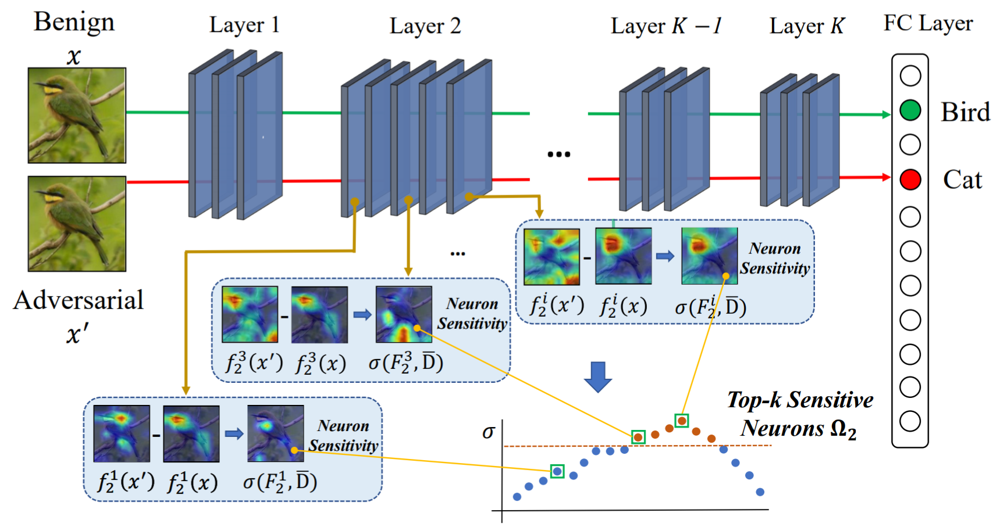
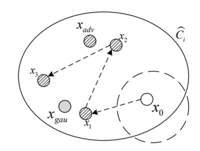
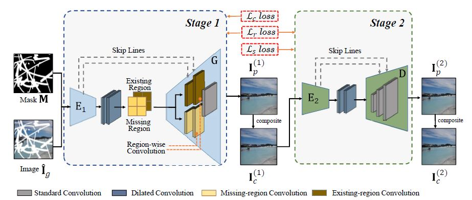
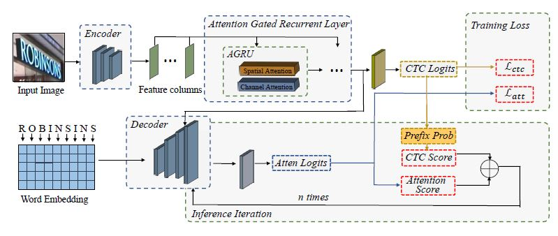
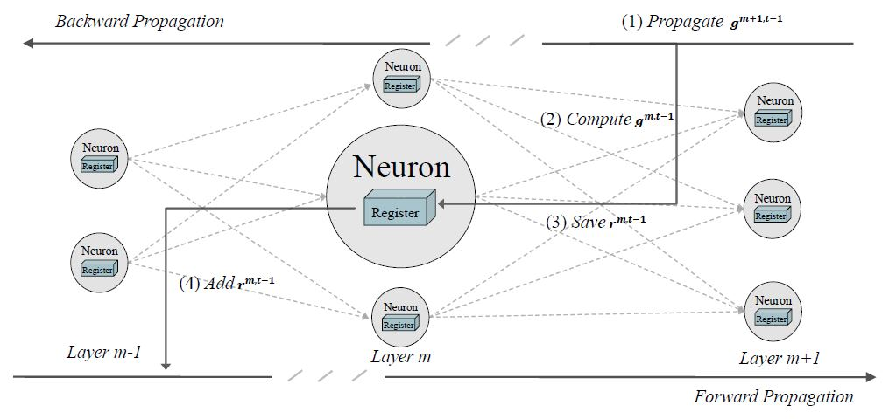

## Aishan Liu (刘艾杉)
-----------
***3rd year Ph.D. Candidate***

[State Key Laboratory of Software Development Environment](http://nlsde.buaa.edu.cn)

School of Computer Science and Engineering, Beihang University, China

Email: liuaishan AT buaa DOT edu DOT cn

Address: Room G602, New Main Building, No.37 Xueyuan Rd., Beijing, China

## About Me
---------------
+ I am currently a Ph.D. candidate in [NLSDE](http://www.nlsde.buaa.edu.cn) at [Beihang University](http://www.buaa.edu.cn), advised by [Prof. Wei Li](http://sites.nlsde.buaa.edu.cn/~liwei/) and [Prof. Xianglong Liu](http://sites.nlsde.buaa.edu.cn/~xlliu/). Before that, I received my B.Sc. degree in Computer Science and Technology in 2013, and got my M.Sc. degree in 2016 under the supervision of Prof. Wei Li.

## Updates
---------------
+ Mar, 2019: One paper accepted for [IJCAI 2019](http://ijcai19.org/)
+ Nov, 2018: One paper accepted for [AAAI 2019](https://aaai.org/Conferences/AAAI-19/)

## Reseach Interests
---------------
My research interests include some sub-fields of ***Computer Vision*** and ***Deep Learning***:
+ **Robust Deep Neural Networks**: Adversarial Example, Model Robustness and Stability, Adversarial Training
+ **Interpretable Deep Learning**: Model Behavior against Noise, Neuron Representation, Feature Visualization
+ **Vision and Language**: Embodied Agent

## Publications
---------------

### Conference Papers
+ Interpreting and Improving Adversarial Robustness with Neuron Sensitivity.
<table class="imgtable"><tbody><tr><td>
</td>
<td align="left"><ul>
 Chongzhi Zhang*, <b>Aishan Liu*</b>, Xianglong Liu and Yitao Xu. (* means equal contribution)
 Under review.
 <tt><a href="#">[pdf]</a></tt> <tt><a href="#">[poster]</a></tt> <tt><a href="#">[code]</a></tt> <tt><a href="#">[bibtex]</a></tt>
</ul>
</td></tr></tbody></table>

+ Towards Noise-Robust Neural Networks via Progressive Adversarial Training.
<table class="imgtable"><tbody><tr><td>
</td>
<td align="left"><ul>
 Hang Yu*, <b>Aishan Liu*</b>, Xianglong Liu and Jichen Yang. (* means equal contribution)
 Under review.
 <tt><a href="#">[pdf]</a></tt> <tt><a href="#">[poster]</a></tt> <tt><a href="#">[code]</a></tt> <tt><a href="#">[bibtex]</a></tt>
</ul>
</td></tr></tbody></table>

+ Coarse-to-Fine Image Inpainting via Region-wise Convolutions and Non-Local Correlation.
<table class="imgtable"><tbody><tr><td>
</td>
<td align="left"><ul>
 Yuqing Ma, Xianglong Liu, Shihao Bai, Lei Wang, Dailan He and <b> Aishan Liu </b>. 
 <a href="http://ijcai19.org/"><i>International Joint Conference on Artificial Intelligence (IJCAI’19)</i></a>, Macao, China, 2019.
 <tt><a href="./files/papers/ijcai19.pdf">[pdf]</a></tt> <tt><a href="#">[poster]</a></tt> <tt><a href="#">[code]</a></tt> <tt><a href="#">[bibtex]</a></tt><
</ul>
</td></tr></tbody></table>

+ An Advancing CTC-Attention Model for Scene Text Recognition.
<table class="imgtable"><tbody><tr><td>
&nbsp;</td>
<td align="left"><ul>
 Jiaxin Fan, Xianglong Liu, Yanlu Wei and <b> Aishan Liu </b>. 
 Under review.
 <tt><a href="#">[pdf]</a></tt> <tt><a href="#">[poster]</a></tt> <tt><a href="#">[code]</a></tt> <tt><a href="#">[bibtex]</a></tt>
</ul>
</td></tr></tbody></table>

+ Training Robust Deep Neural Networks via Adversarial Noise Propagation.
<table class="imgtable"><tbody><tr><td>
&nbsp;</td>
<td align="left"><ul>
 <b>Aishan Liu</b>, Xianglong Liu, Chongzhi Zhang, Hang Yu, Qiang Liu and Junfei He.
 Under review.
 <tt><a href="#">[pdf]</a></tt> <tt><a href="#">[poster]</a></tt> <tt><a href="#">[code]</a></tt> <tt><a href="#">[bibtex]</a></tt>
</ul>
</td></tr></tbody></table>

+ Perceptual Sensitive GAN for Generating Adversarial Patches.
<table class="imgtable"><tbody><tr><td>
&nbsp;</td>
<td align="left"><ul>
 <b>Aishan Liu</b>, Xianglong Liu, Jiaxin Fan, Yuqing Ma, Anlan Zhang, Huiyuan Xie and Dacheng Tao.
 <a href="https://aaai.org/Conferences/AAAI-19/"><i>AAAI Conference on Artificial Intelligence (AAAI’19)</i></a>, Honolulu, Hawaii, USA, 2019.
 <tt><a href="./files/papers/psgan_aaai2019.pdf">[pdf]</a></tt> <tt><a href="#">[poster]</a></tt> <tt><a href="./files/papers/psgan_aaai2019.bib">[bibtex]</a></tt>
</ul>
</td></tr></tbody></table>

## Main Awards & Honors
---------------

+ Tencent Rhino-Bird Elite Training Program, 2019.05. (Nationwide 56)
+ AAAI-19 Student Scholarship, AAAI, 2019.01.
+ Outstanding Graduate Award, Beihang University, 2016.01.
+ Guanghua Scholarship, Beihang University, 2015.12.
+ Outstanding Graduate Award, Beijing, 2013.06.
+ CCF National Outstanding Undergraduate, China, 2012.10. (Nationwide 100)
+ Google Excellence Scholarship, Google, 2012.06.

## Professional Activities
---------------
### Conference Reviewer / Program Committee Member
+ IJCAI 2019
+ ACM MM 2019

### Journal Reviewer
+ Pattern Recognition

## Education
---------------
<ul>
<li>
Sep. 2017 - Present

<ul>
<li>Ph.D. student in Computer Science, School of Computer Science and Engineering, Beihang University</li>
<li>Advisor: Profs. <a href="http://sites.nlsde.buaa.edu.cn/~liwei/">Wei Li</a> and co-advised by Profs. <a href="http://sites.nlsde.buaa.edu.cn/~xlliu/">Xianglong Liu</a> </li>
</ul>
</li>
<li>
Sep. 2013 - Jan. 2016

<ul>
<li>Master student in Computer Science, School of Computer Science and Engineering, Beihang University</li>
<li>Advisor: Profs. <a href="http://sites.nlsde.buaa.edu.cn/~liwei/">Wei Li</a> </li>
</ul>
</li>
<li>
Sep. 2009 - Jun. 2013

<ul>
<li>B.Sc in Computer Science, School of Computer Science and Engineering, Beihang University</ul>
</li>
</ul>

## Main Co-authors
-----------
[Xianglong Liu](http://sites.nlsde.buaa.edu.cn/~xlliu/)
